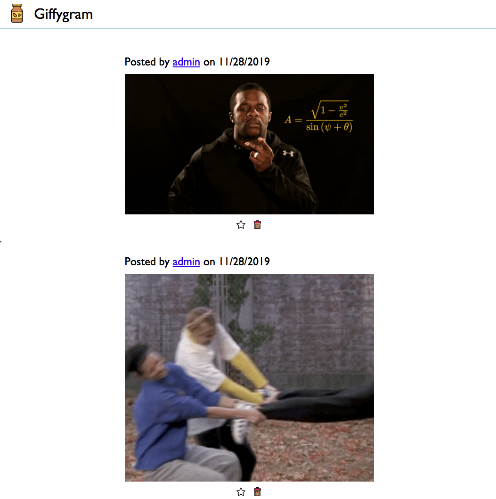

# Giffygram

Track your friends' favorite gifs.

## Setup

1. Install API server with `npm i -g json-server-auth`
1. Clone this repository

### Starting the API

Open a terminal window and go to the `giffygram` directory.

1. `cd api`
1. `json-server-auth -p 8088 -r routes.json`

### Starting the Web Server

Open a terminal window and go to the `giffygram` directory.

1. `cd src`
1. `serve -l 8080` or `hs` if you have set up the alias

Then visit http://localhost:8080 and login with the following credentials.

* Email: admin@admin.com
* Password: Admin8*

Once you are authenticated, you should see two posts render to the feed component.